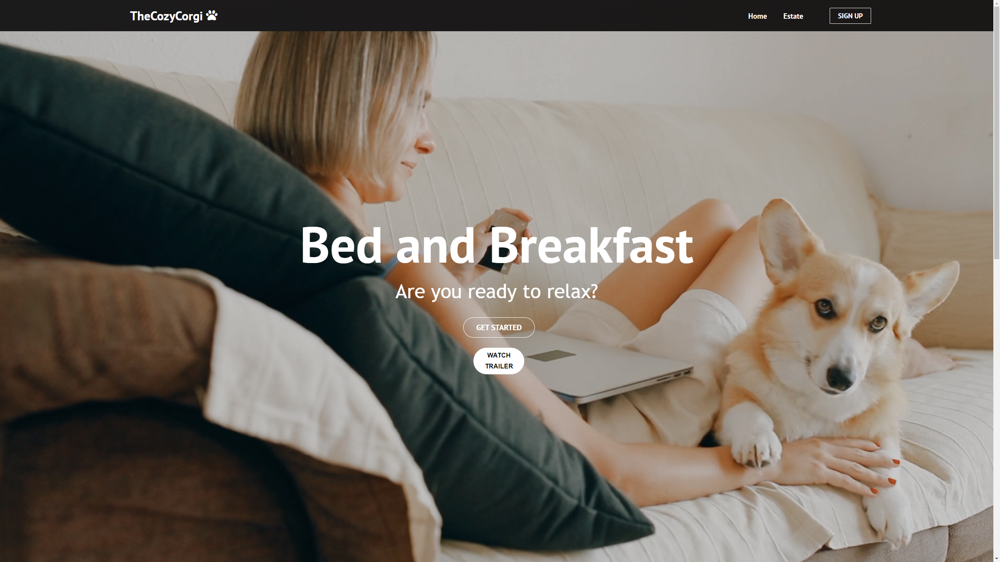
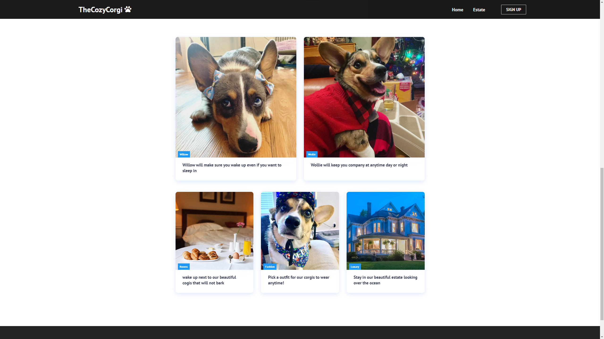
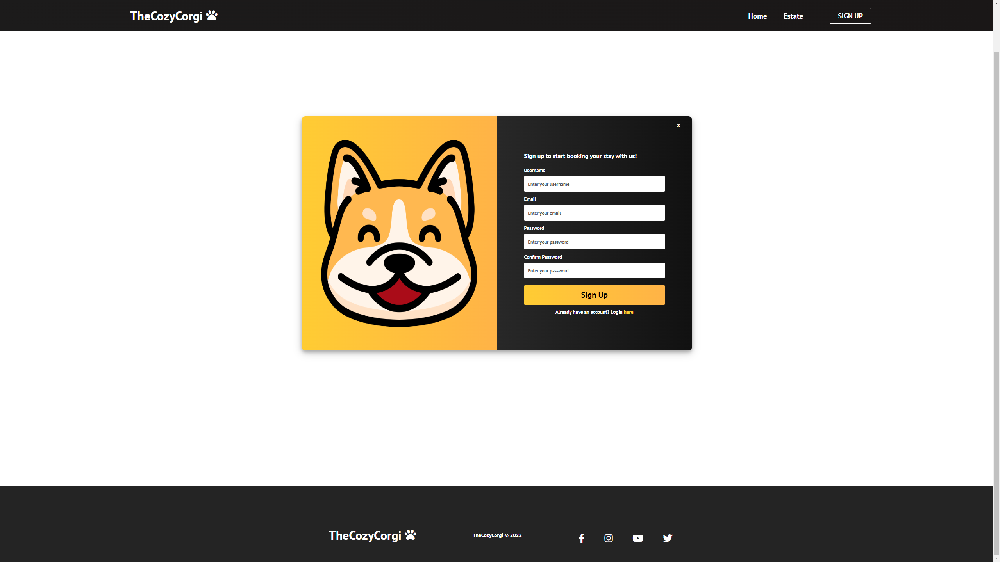

# Project Title

Corgi Land

## Demo link: https://thecozicorgi.tyler-allen.com/

<!-- Access my site at [google.com](https://google.com) -->

## About The App

[the cozy coegi] is a mobile responsive website with different pages leading to different parts of the website. the website has a signup page with form validation.
## Screenshots

## Technologies

  &nbsp;
  &nbsp;
  &nbsp;
  &nbsp;
  &nbsp;

## Approach

Built with React and styled with CSS and material UI. Used react router to navigate pages.

